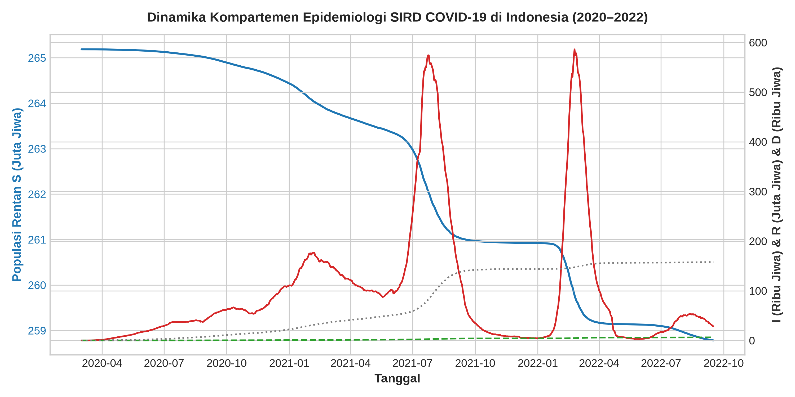
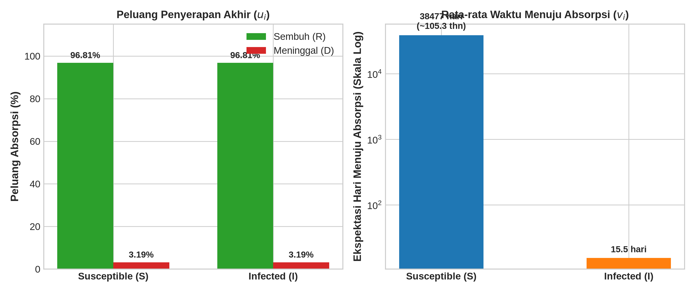

# Absorbing Markov Chain Modeling of COVID-19 Infection Dynamics in Indonesia Using First Step Analysis

[](https://www.python.org/downloads/)
[](https://opensource.org/licenses/MIT)
[](https://www.latex-project.org/)
[](https://jupyter.org/)

Repositori ini memuat implementasi komputasi, simulasi numerik, analisis analitis aljabar, dan laporan kasus ilmiah tertulis untuk **Pemodelan Rantai Markov Waktu Diskret (DTMC) Berkeadaan Penyerap (*Absorbing Markov Chain*)** pada dinamika penularan COVID-19 di Indonesia menggunakan metode **Analisis Langkah Pertama (*First Step Analysis / FSA*)** dan **Teori Matriks Fundamental Kemeny-Snell**.

> **Konteks Akademis:**  
> Program Studi S1 Matematika, Fakultas Matematika dan Ilmu Pengetahuan Alam (FMIPA)  
> **Universitas Sebelas Maret (UNS)**, Surakarta  
> Mata Kuliah: *Pengantar Proses Stokastik*  
> Dosen Pengampu: **Ade Susanti, S.Si., M.Si.**  
> 
> **Kelompok 1:**
> 1. Fadhila Hardi Ningrum (M0124004)
> 2. Karunia Febyayu Puspitaningtyas (M0124010)
> 3. Ramadhan Imanur Rochim (M0124015)
> 4. Achika Vigo Azhyra (M0125001)
> 5. Fawwaz Absyar Rifai (M0125044)

---

## 1. Ringkasan Proyek & Fenomena Nyata

Dinamika transmisi penyakit menular seperti COVID-19 umumnya didekati melalui sistem persamaan diferensial kompartemen SIR/SIRD deterministik yang sensitif terhadap fluktuasi parameter. Penelitian ini menerapkan pendekatan **stokastik berbasis data deret waktu harian** (*time series data*) selama **929 hari kalender** (2 Maret 2020 hingga 16 September 2022) di Indonesia yang bersumber resmi dari **Satuan Tugas Penanganan COVID-19** dan **Kementerian Kesehatan RI**.

Proses dimodelkan sebagai Rantai Markov Waktu Diskret berorde $4 \times 4$ dengan ruang keadaan:
$$\mathcal{S} = \{S, I, R, D\}$$
- $S$ (*Susceptible* / Rentan): Individu sehat yang berisiko terinfeksi.
- $I$ (*Infected* / Terinfeksi): Individu terkonfirmasi aktif yang dapat menularkan penyakit.
- $R$ (*Recovered* / Sembuh): Individu yang telah sembuh dan diasumsikan memiliki antibodi protektif (**Keadaan Penyerap / *Absorbing State***).
- $D$ (*Death* / Meninggal Dunia): Individu yang meninggal dunia akibat COVID-19 (**Keadaan Penyerap / *Absorbing State***).

---

## 2. Formulasi Matematis

### A. Matriks Peluang Transisi $P$
Berdasarkan agregasi 929 hari pengamatan dengan populasi konstan $N = 265.185.520$ jiwa, parameter peluang transisi harian empiris diestimasi sebagai:
- $P_{SI} = 0{,}000026$ (laju transmisi harian per kapita)
- $P_{SS} = 1 - P_{SI} = 0{,}999974$
- $P_{IR} = 0{,}062643$ (laju kesembuhan harian)
- $P_{ID} = 0{,}002064$ (laju kematian harian)
- $P_{II} = 1 - P_{IR} - P_{ID} = 0{,}935293$
- $P_{RR} = 1, \quad P_{DD} = 1$ (*absorbing states*)

Matriks peluang transisi $P$ berorde $4 \times 4$:
$$P = \begin{pmatrix} 0{,}999974 & 0{,}000026 & 0 & 0 \\ 0 & 0{,}935293 & 0{,}062643 & 0{,}002064 \\ 0 & 0 & 1 & 0 \\ 0 & 0 & 0 & 1 \end{pmatrix}$$
Seluruh entri memenuhi syarat mutlak matriks stokastik: $P_{ij} \ge 0$ dan $\sum_j P_{ij} = 1$ untuk setiap baris.

### B. Bentuk Kanonik & Matriks Fundamental Kemeny-Snell
Dengan mempartisi ruang keadaan ke dalam himpunan transien $\{S, I\}$ dan penyerap $\{R, D\}$, matriks $P$ disusun ke dalam bentuk kanonik:
$$P = \begin{pmatrix} Q & R \\ \mathbf{0} & I \end{pmatrix}, \quad Q = \begin{pmatrix} 0{,}999974 & 0{,}000026 \\ 0 & 0{,}935293 \end{pmatrix}, \quad R = \begin{pmatrix} 0 & 0 \\ 0{,}062643 & 0{,}002064 \end{pmatrix}$$

Matriks fundamental Kemeny-Snell $N = (I - Q)^{-1}$:
$$N = \begin{pmatrix} 0{,}000026 & -0{,}000026 \\ 0 & 0{,}064707 \end{pmatrix}^{-1} = \begin{pmatrix} 38.461{,}5385 & 15{,}4543 \\ 0 & 15{,}4543 \end{pmatrix}$$

---

## 3. Hasil Analisis Langkah Pertama (*First Step Analysis*)

Sistem persamaan langkah pertama diturunkan secara analitis aljabar untuk mencari:
1. **Peluang Penyerapan Akhir ($u_i$)**: Peluang proses terserap ke status Sembuh ($R$).
2. **Ekspektasi Waktu Penyerapan ($v_i$)**: Rata-rata hari yang dibutuhkan hingga mencapai resolusi akhir ($R$ atau $D$).

| Status Awal ($i$) | Peluang Sembuh ($u_i^{(R)}$) | Peluang Meninggal ($u_i^{(D)}$) | Waktu Menuju Penyerapan ($v_i$) | Interpretasi Praktis & Relevansi Epidemiologi |
| :---: | :---: | :---: | :---: | :--- |
| **Terinfeksi ($I$)** | **96,81%** | **3,19%** | **15,45 hari** ($\approx 2{,}2$ minggu) | Durasi sakit konsisten dengan rekomendasi isolasi mandiri Kemenkes RI & protokol PDPI (10–14 hari). Peluang mortalitas sejalan dengan *Case Fatality Rate* (CFR) nasional (2,5%–3,3%). |
| **Rentan ($S$)** | **96,81%** | **3,19%** | **38.476,99 hari** ($\approx 105{,}3$ tahun) | Rata-rata waktu tunggu hingga tertular dan mencapai status akhir dalam kondisi laju konstan tanpa intervensi. Mencerminkan peluang transmisi per kapita ($P_{SI}$) yang kecil terhadap populasi total masif (265 juta). |

### Validasi Silang Teori Matriks Fundamental:
- **Waktu Penyerapan**: $\mathbf{v} = N\mathbf{1} = \begin{pmatrix} 38.476{,}99 \\ 15{,}4543 \end{pmatrix}$ hari.
- **Peluang Penyerapan**: $B = NR = \begin{pmatrix} 0{,}9681 & 0{,}0319 \\ 0{,}9681 & 0{,}0319 \end{pmatrix}$.
- **Dekomposisi Waktu**: Pembuktian analitis adjoin membuktikan $v_S = \frac{1}{P_{SI}} + v_I = 38.461{,}54 + 15{,}45 = 38.476{,}99$ hari, menerangkan bahwa seluruh individu rentan harus melewati status infeksi aktif sebelum terserap.

---

## 4. Evaluasi Kritis Asumsi Markov

Model ini mengevaluasi 4 batasan ilmiah asumsi Markov (*memoryless property*):
1. **Sifat Nir-Memori (*Memoryless*)**: Peluang transisi diasumsikan independen terhadap lama waktu sakit. Kenyataannya, daya tahan tubuh dan beban virus (*viral load*) berubah seiring usia infeksi (*infection age*).
2. **Homogenitas Waktu**: Matriks $P$ nyata di lapangan berfluktuasi akibat varian mutasi baru (Delta, Omicron), pengetatan mobilitas (PPKM), dan vaksinasi massal.
3. **Pencampuran Homogen**: Penularan lebih pekat pada aglomerasi perkotaan dan risiko fatalitas meningkat tajam pada kelompok komorbid/lansia.
4. **Solusi Pengembangan**: Rekomendasi penggunaan rantai semi-Markov dengan waktu tinggal (*sojourn time*) berdistribusi Weibull/Gamma atau model regresi bahaya proporsional Cox multi-state.

---

## 5. Visualisasi Hasil

| Dinamika Runtut Waktu SIRD (2020–2022) | Hasil Analisis Langkah Pertama ($u_i, v_i$) |
| :---: | :---: |
|  |  |

---

## 6. Struktur Direktori Repositori

```text
absorbing-markov-chain-covid19-indonesia/
├── .gitignore                      # Filter komprehensif cache Python, Jupyter, dan LaTeX
├── LICENSE                         # Lisensi sumber terbuka MIT
├── README.md                       # Dokumentasi resmi proyek, teori matematika, & hasil empiris
├── code/
│   ├── requirements.txt            # Dependensi Python (numpy, scipy, sympy, pandas, matplotlib)
│   ├── data/
│   │   ├── raw/                    # Dataset mentah 929 hari COVID-19 Indonesia (Kaggle/Satgas)
│   │   │   └── covid_19_indonesia_time_series_all.csv
│   │   └── processed/              # Matriks transisi dan deret kompartemen harian terstandardisasi
│   │       ├── data_sird_harian.csv
│   │       ├── matriks_P_sird.csv
│   │       ├── matriks_Q_sird.csv
│   │       ├── matriks_R_sird.csv
│   │       ├── matriks_N_sird.csv
│   │       └── matriks_B_sird.csv
│   ├── notebooks/
│   │   ├── 01_fenomena_dan_data.ipynb      # Pembersihan data & estimasi peluang transisi
│   │   └── 02_first_step_analysis.ipynb    # Komputasi simbolik (SymPy) & numerik FSA + Kemeny-Snell
│   ├── scripts/
│   │   ├── fsa_solver.py           # Engine analitis matriks fundamental & eliminasi aljabar
│   │   └── verify_sird_calculation.py # Skrip verifikasi independen aljabar analitis
│   └── figures/                    # Grafik visualisasi resolusi tinggi (DPI 300)
│       ├── dinamika_sird_indonesia.png
│       └── hasil_fsa_sird.png
└── report/
    ├── logo_uns.png                # Logo resmi Universitas Sebelas Maret
    ├── references.bib              # Bibliografi BibTeX 9 pustaka primer (model Plain/Numerik)
    ├── laporan.tex                 # Naskah ilmiah LaTeX standar resmi Matematika FMIPA UNS
    ├── laporan.pdf                 # Hasil kompilasi naskah resmi (10 halaman inti + 3 lampiran)
    └── Kelompok 1.pdf              # Salinan berkas deliverable resmi Kelompok 1
```

---

## 7. Panduan Penggunaan & Replikasi

### Prasyarat
- Python 3.10 atau versi yang lebih baru
- Distribusi TeX Live (untuk kompilasi dokumen LaTeX ke PDF)

### A. Menjalankan Komputasi Python
```bash
# 1. Masuk ke direktori repositori
cd absorbing-markov-chain-covid19-indonesia

# 2. Pasang pustaka dependensi
pip install -r code/requirements.txt

# 3. Jalankan skrip verifikasi analitis
python3 code/scripts/verify_sird_calculation.py

# 4. Jalankan Jupyter Notebook untuk eksplorasi interaktif
jupyter notebook code/notebooks/
```

### B. Kompilasi Dokumen Laporan LaTeX
```bash
cd report
pdflatex -interaction=nonstopmode laporan.tex
bibtex laporan
pdflatex -interaction=nonstopmode laporan.tex
pdflatex -interaction=nonstopmode laporan.tex
```

---

## 8. Lisensi & Sitasi

Proyek ini didistribusikan di bawah lisensi terbuka [MIT License](LICENSE).

Jika Anda menggunakan model matematika, data olahan, atau kode dari repositori ini, silakan sitasi sebagai:
```bibtex
@misc{kelompok1_stokastik_uns_2026,
  author    = {Fadhila Hardi Ningrum and Karunia Febyayu Puspitaningtyas and Ramadhan Imanur Rochim and Achika Vigo Azhyra and Fawwaz Absyar Rifai},
  title     = {{Pemodelan Rantai Markov Absorbing State pada Dinamika Transisi Status Infeksi COVID-19 di Indonesia}},
  year      = {2026},
  publisher = {GitHub},
  howpublished = {\url{https://github.com/ramadhan-imanur/absorbing-markov-chain-covid19-indonesia}},
  institution = {Program Studi S1 Matematika, FMIPA Universitas Sebelas Maret}
}
```
